# Rangkuman Eksperimen — Klasifikasi Multiclass Kualitas Teh Hijau (E-Nose)

Dokumen ini merangkum seluruh eksperimen pada `notebooks/new_processing.ipynb`: dari preprocessing,
metodologi evaluasi anti-leakage, HPO, sampai analisis hasil & visualisasi dan pemilihan model terbaik.

---

## 1. Ringkasan Eksekutif

- **Tugas**: klasifikasi **5 kelas** (A, B, C, D, E) dari **12 fitur sensor gas** (e-nose) — dataset **sangat imbalance**.
- **Model terbaik (seri statistik)**: **CatBoost ≈ SVC-rbf**, dengan **Composite ≈ 0.938** (macro-F1 ≈ 0.91, MCC ≈ 0.87–0.88, AUROC ≈ 0.99, PRAUC ≈ 0.97).
- **Rekomendasi final**: **CatBoost** sebagai model utama (lebih unggul untuk tujuan imbalance: F1, kalibrasi,
  recall kelas minoritas, stabilitas), **SVC-rbf** sebagai pembanding setara (akurasi/AUROC sedikit lebih tinggi
  & paling efisien-tuning).
- **Temuan kunci**: kelas minoritas **B justru PALING mudah** dikenali; kelas **tersulit adalah D** (tertukar dengan A/E).
- **Catatan**: semua model kuat **overconfident** (probabilitas overfit); error & performa bersifat **terbatas oleh jumlah data**, bukan kapasitas model.

---

## 2. Dataset & Tantangan

| Level | Jumlah unit | Distribusi kelas |
|---|---|---|
| **Baris** | 10.409 | E 44.7% · D 22.3% · C 22.0% · A 8.9% · **B 2.2%** |
| **Sampling_ID** | 274 | E 132 · C 58 · D 55 · A 20 · **B 9** |
| **Chop_ID** (sampel fisik) | 69 | E 36 · C 14 · D 13 · A 4 · **B 2** |

- **Imbalance ekstrem**: rasio E:B ≈ **20:1**.
- **Struktur berkelompok**: 10.409 baris hanya berasal dari **69 sampel fisik** (Chop_ID) / 274 Sampling_ID — tiap sampel direkam ~40 baris deret waktu sensor.
- **Bukti rawan leakage**: variasi antar-baris dalam satu `Sampling_ID` hanya **5.5%–22.5%** dari variasi keseluruhan → baris dari sampel yang sama nyaris kembar. Split acak per-baris akan membocorkan "kembaran" ke train & test sekaligus.

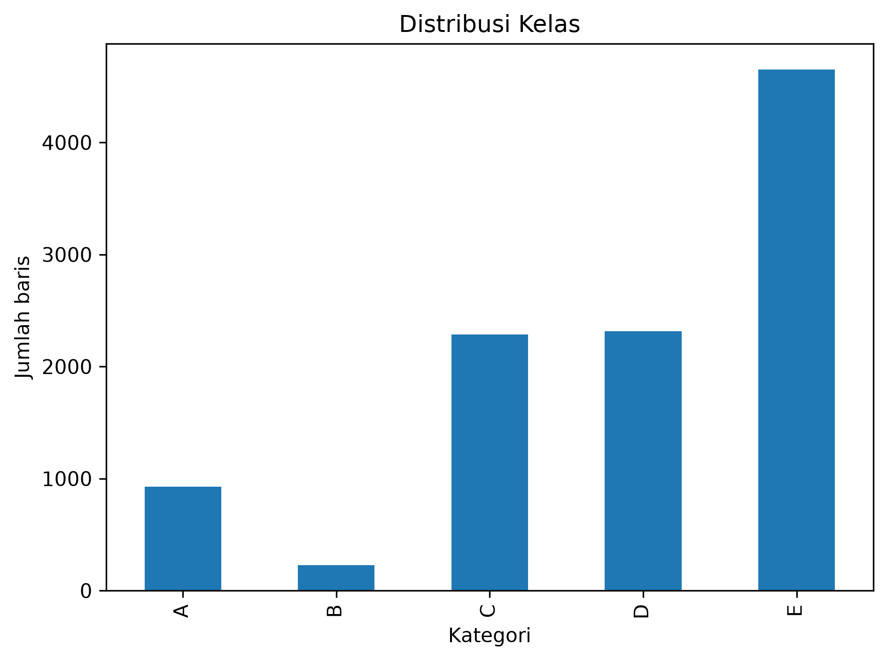

---

## 3. Preprocessing (Anti-Leakage)

1. **Split sadar-grup**: `StratifiedGroupKFold` (5 fold) berbasis **`Sampling_ID`** — baris dari sampling sama tidak pernah lintas train/test → **menghilangkan leakage** sekaligus menjaga proporsi kelas (stratified). Diverifikasi: tidak ada grup beririsan antar fold.
2. **1 baris = 1 data**: seluruh 10.409 baris tetap dipakai (training tetap "banjir data"), hanya garis pemisah fold yang sadar-grup.
3. **Scaling**: `StandardScaler` — **fit hanya di train fold** (di dalam `Pipeline`).
4. **PCA**: dijadikan **hyperparameter yang dituning** (`n_components ∈ {3, 5, 8, 12}`), fit hanya di train fold. Explained variance kumulatif: n=5 → 93.6%, n=8 → 98.3%, n=12 → 100%.
   - **PCA optimal hasil HPO: `n_components = 12`** (semua model terbaik memilih 12 = tanpa reduksi; reduksi lebih kecil menurunkan informasi diskriminatif).
5. **Imbalance handling**: SVC `class_weight='balanced'`, CatBoost `auto_class_weights='Balanced'`.
6. **Pipeline** `Scaler → PCA → Model` memastikan scaler & PCA **selalu fit di train fold saja** (anti-leakage saat CV/learning curve).

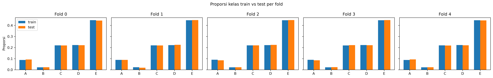

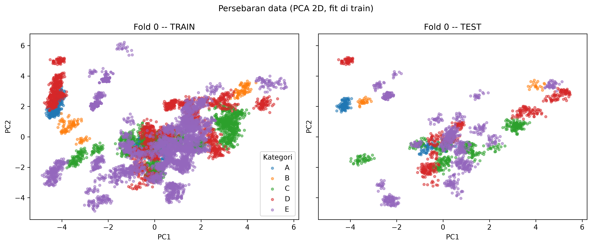

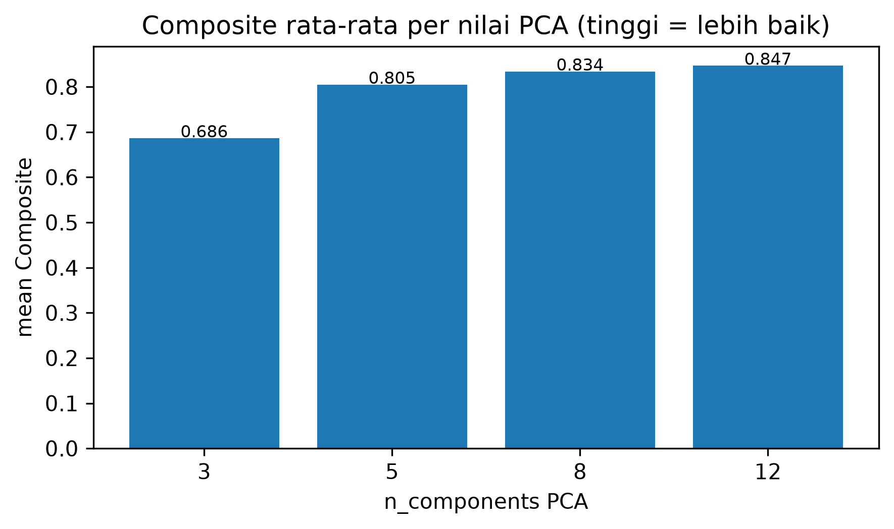

---

## 4. Metodologi Evaluasi

- **Cross-validation**: StratifiedGroupKFold 5-fold (group-aware), `random_state=42`.
- **Metrik dilaporkan**: Accuracy, Precision (macro), Recall (macro), **macro-F1**, **MCC**, **AUROC** (OvR macro), **PRAUC** (OvR macro) — semua `mean ± std` antar-fold.
- **Composite score** (metrik seleksi best param), dirancang untuk kasus imbalance:

  ```
  Composite = mean( macro-F1 , (MCC + 1) / 2 , PRAUC )
  ```

  - **macro-F1**: kualitas keputusan, bobot sama tiap kelas (minoritas diperhitungkan adil).
  - **(MCC+1)/2**: korelasi seimbang seluruh confusion matrix, dinormalisasi ke [0,1].
  - **PRAUC**: kualitas ranking probabilitas, peka terhadap kelas minoritas.
  - **Accuracy & AUROC sengaja tidak dipakai** di composite (Accuracy bias ke mayoritas; AUROC optimistis saat imbalance) — tetapi tetap dilaporkan.

---

## 5. Search Space (HPO Grid Search)

Total **488 konfigurasi** (= grid hyperparameter × {PCA 3/5/8/12}), tiap config dievaluasi 5-fold.

| Model | Hyperparameter |
|---|---|
| SVC-linear | C ∈ {0.01, 0.1, 1, 10, 100} |
| SVC-rbf | C ∈ {0.1, 1, 10, 100}, gamma ∈ {scale, 0.01, 0.1} |
| SVC-poly | C ∈ {1, 10}, degree ∈ {2, 3, 4}, gamma ∈ {scale, 0.1} |
| SVC-sigmoid | C ∈ {0.1, 1, 10}, gamma ∈ {scale, 0.01, 0.1} |
| XGBoost (gbtree, dart) | n_estimators ∈ {200, 400}, max_depth ∈ {3, 6}, learning_rate ∈ {0.05, 0.1, 0.3}, reg_lambda ∈ {1, 10} |
| CatBoost | depth ∈ {4, 6}, learning_rate ∈ {0.03, 0.05, 0.1}, iterations ∈ {300, 500}, l2_leaf_reg ∈ {3, 5, 10} |

Semua + `pca__n_components ∈ {3, 5, 8, 12}`. Log per-fold disimpan ke `logs/hpo_log.txt`; hasil terstruktur ke `logs/hpo_results.jsonl` (checkpoint/resume).

---

## 6. Hasil Komparasi Best-Param per Model

(Best config dipilih berdasarkan Composite; semua memilih `pca=12`.)

| Model | Acc | Prec | Recall | macro-F1 | MCC | AUROC | PRAUC | **Composite** |
|---|---|---|---|---|---|---|---|---|
| **CatBoost** (depth6, it500, l2=3, lr0.1) | 0.9076 | 0.9135 | 0.9172 | 0.9124 | 0.8689 | 0.9895 | 0.9669 | **0.9379** |
| **SVC-rbf** (C100, gamma=scale) | 0.9155 | 0.9051 | 0.9132 | 0.9068 | 0.8800 | 0.9916 | 0.9667 | **0.9378** |
| XGB-dart (lr0.3, md6, n400, λ1) | 0.8979 | 0.9114 | 0.8848 | 0.8934 | 0.8544 | 0.9844 | 0.9519 | 0.9242 |
| XGB-gbtree (lr0.3, md6, n400, λ1) | 0.8979 | 0.9114 | 0.8848 | 0.8934 | 0.8544 | 0.9844 | 0.9519 | 0.9242 |
| SVC-poly (C10, d3, gamma0.1) | 0.8278 | 0.8020 | 0.8664 | 0.8229 | 0.7658 | 0.9591 | 0.8920 | 0.8659 |
| SVC-linear (C100) | 0.5378 | 0.5006 | 0.6186 | 0.5029 | 0.4020 | 0.8681 | 0.6203 | 0.6081 |
| SVC-sigmoid (C1, gamma0.01) | 0.4755 | 0.4553 | 0.5720 | 0.4241 | 0.3467 | 0.8313 | 0.4946 | 0.5307 |

**Tiga tier jelas**: (1) kuat — CatBoost, SVC-rbf, XGBoost; (2) menengah — SVC-poly; (3) gagal/underfit — SVC-linear, SVC-sigmoid.

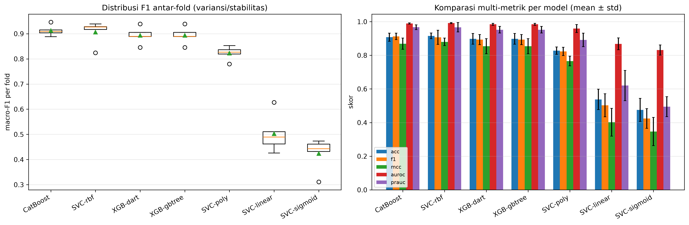

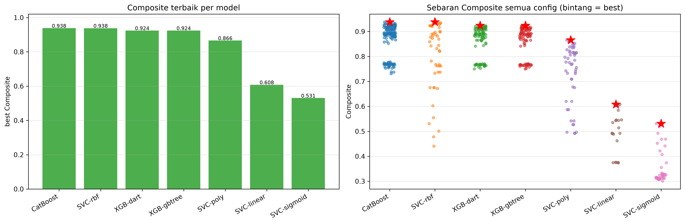

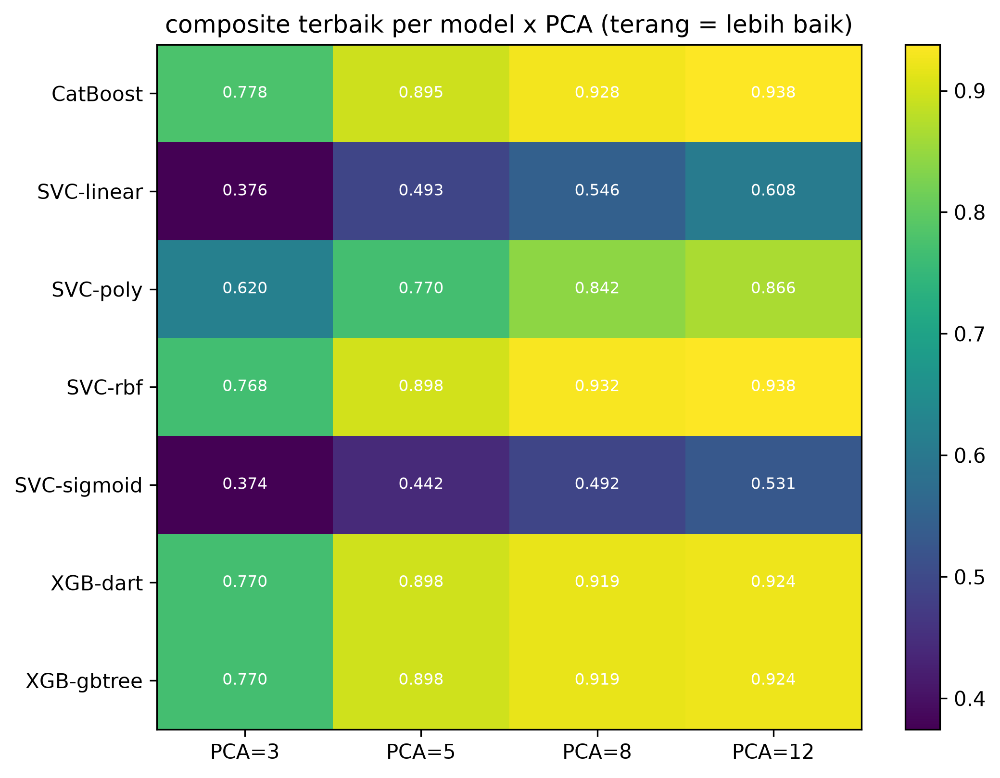

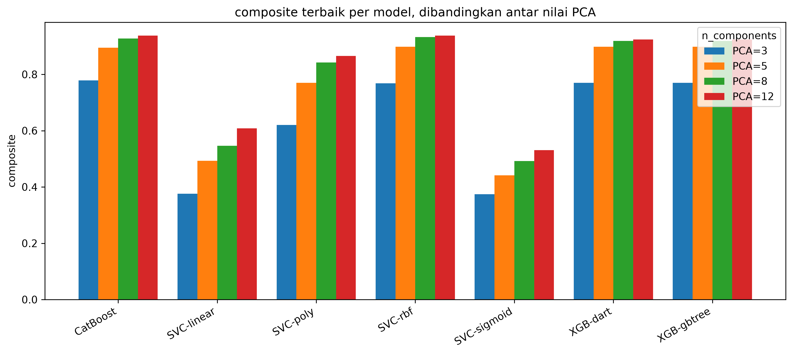

---

## 7. Analisis per Kelas (Confusion Matrix & ROC/PR-OvR)

**Temuan utama (mengoreksi asumsi awal): kelas minoritas B = PALING MUDAH, bukan tersulit.**

Recall per kelas (OOF, model terbaik **CatBoost**): A 0.89 · **B 1.00** · C 0.92 · D **0.86** · E 0.92.
ROC-OvR AUC CatBoost: A 0.989 · **B 1.000** · C 0.994 · **D 0.973** · E 0.988.

- **B** sangat separabel di semua model (recall 0.79–1.00) meski paling langka → kemungkinan kualitas teh yang secara kimiawi paling berbeda.
- **Kelas tersulit = D** (recall terendah pada model kuat), tertukar terutama dengan **A dan E** — grade kualitas berdekatan yang saling tumpang tindih.
- **Kesimpulan**: kesulitan klasifikasi didorong **kemiripan antar-grade berdekatan (A–D–E)**, bukan oleh kelangkaan kelas.

**PR lebih jujur daripada ROC saat imbalance**: model lemah (linear/sigmoid) punya ROC-AUC 0.885/0.855 (terlihat "lumayan") tetapi PR-AP 0.662/0.601 (jelas buruk) — alasan PRAUC/macro lebih dipercaya di sini.

ROC/PR micro-average (komparasi model): SVC-rbf AUC **0.991** / AP **0.973** > CatBoost 0.990 / 0.966 > XGB 0.986 / 0.957 > SVC-poly 0.960 / 0.894 > SVC-linear 0.885 / 0.662 > SVC-sigmoid 0.855 / 0.601.

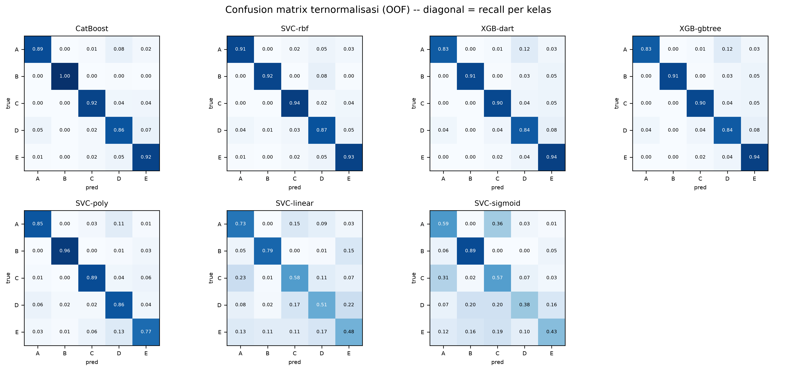

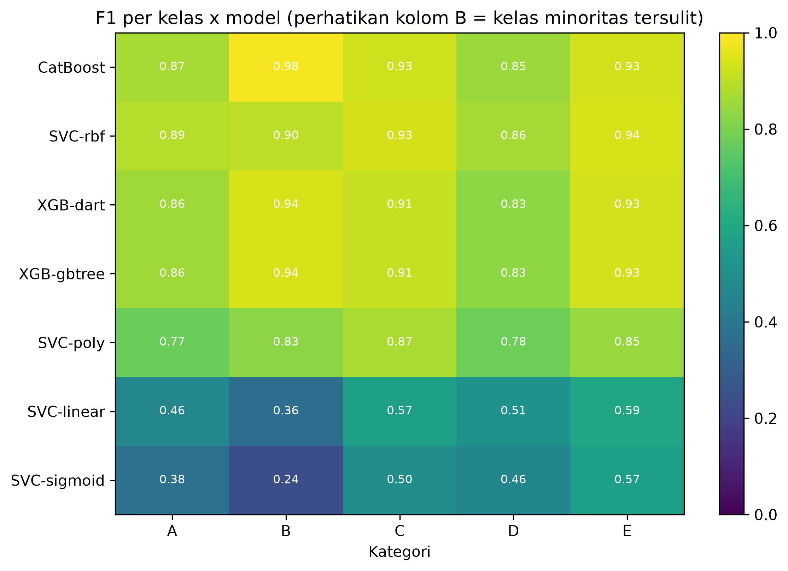

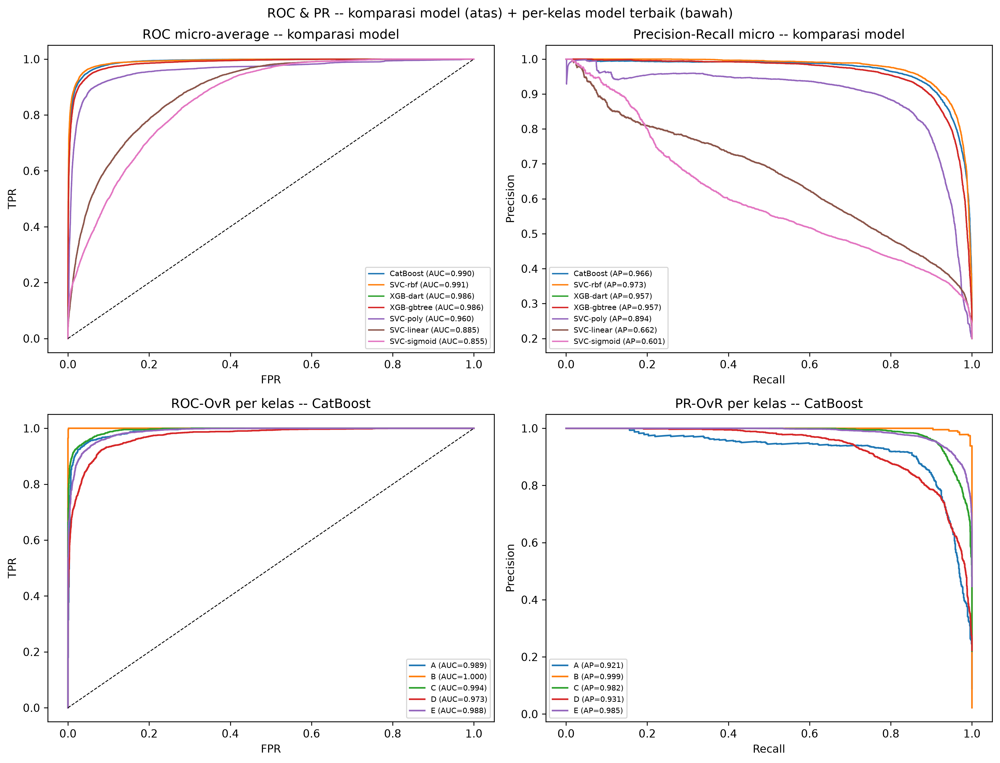

---

## 8. Analisis Underfitting / Overfitting

**Gap train vs test (CV) + learning curve (macro-F1 & log-loss):**

- **Tier kuat (CatBoost, SVC-rbf, XGBoost)**: train F1 ≈ **1.0**, test F1 ≈ 0.89–0.91, **gap ≈ 0.09–0.11** → **overfit ringan-sedang**.
  - **log-loss mengungkap yang disembunyikan F1**: train log-loss ≈ 0.003–0.013 sementara validasi jauh lebih tinggi → overfit nyata di ruang probabilitas.
  - **Kurva validasi masih MENANJAK** di data penuh (belum plateau) → **penghambat utama = jumlah data (sampel independen), bukan kapasitas model**. Menambah data akan terus menutup gap.
- **SVC-linear & SVC-sigmoid**: train F1 rendah (0.5–0.7) dan **menurun** saat data bertambah, val juga rendah → **underfitting (high bias)**; kernel terlalu sederhana untuk data non-linear.

**Diagnosa**: model kuat = overfit "jenis baik" (terbatas data, bukan kapasitas); model linear/sigmoid = underfit.

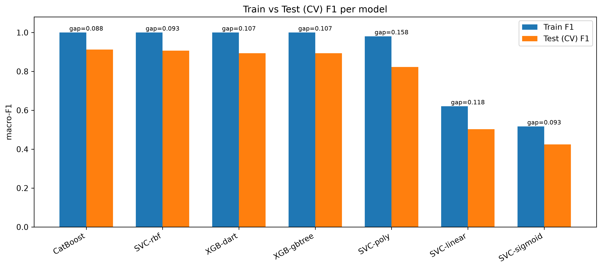

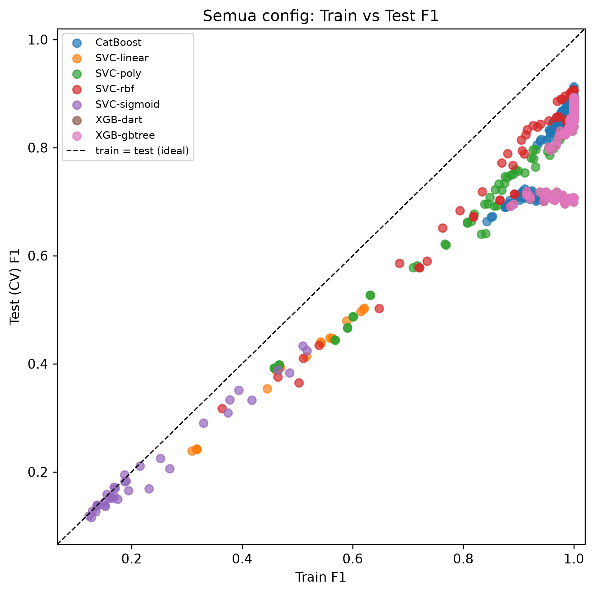

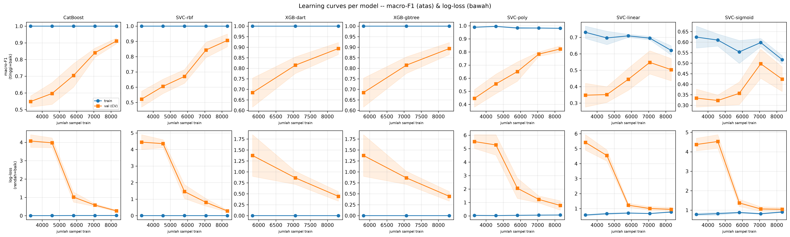

---

## 9. Kalibrasi Probabilitas

Reliability diagram: **semua model overconfident** (titik di bawah garis ideal) → konfirmasi visual dari temuan log-loss.
- **CatBoost paling dekat terkalibrasi**; XGBoost paling overconfident.
- Implikasi: **keputusan (argmax) tetap akurat**, tetapi **angka probabilitas jangan dipercaya mentah**. Jika probabilitas/threshold dipakai di deployment → lakukan kalibrasi (mis. `CalibratedClassifierCV` / temperature scaling).

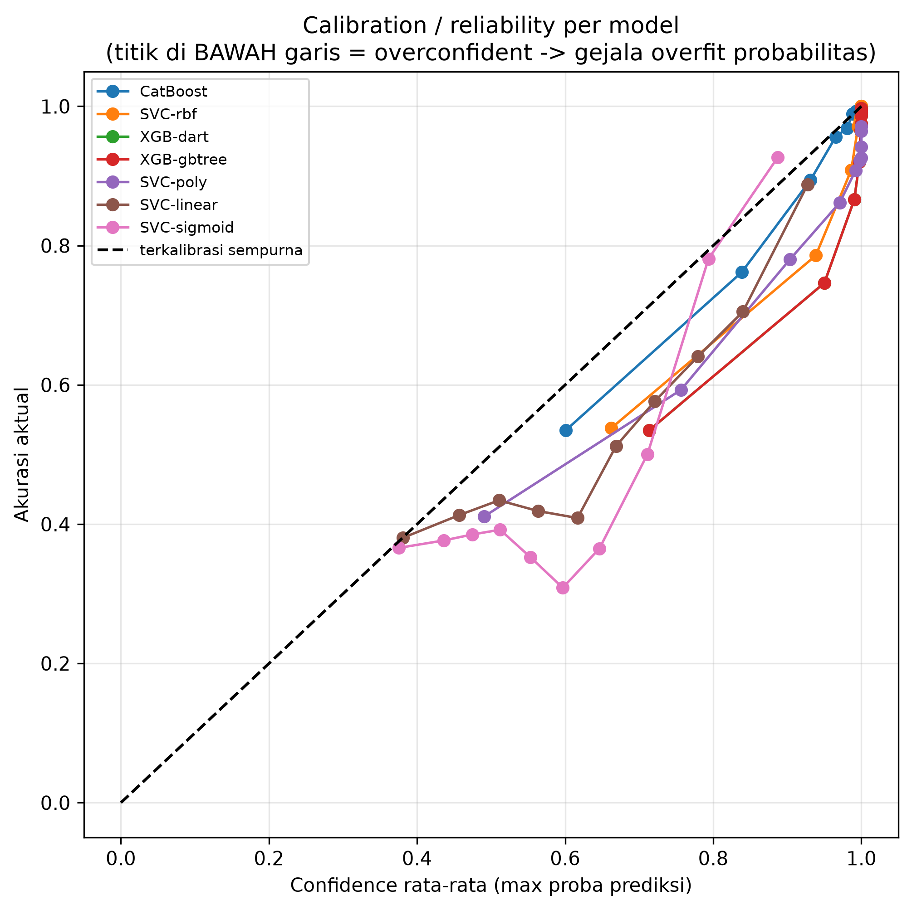

---

## 10. Efisiensi Pencarian (Model Tercepat Capai Best Composite)

Dihitung dari sebaran composite seluruh 488 config (efisiensi = jumlah config menuju near-best; waktu training tidak dicatat).

| Model | best | mean | % config near-best | exp. #config → near-best |
|---|---|---|---|---|
| CatBoost | 0.938 | **0.869** | 6.2% | 16.0 |
| **SVC-rbf** | 0.938 | 0.803 | 14.6% | **6.9** |
| XGB-dart/gbtree | 0.924 | 0.862 | 12.5% | 8.0 |
| SVC-poly | 0.866 | 0.729 | 4.2% | 24.0 |

- **SVC-rbf = paling efisien-tuning**: mencapai composite ≈ 0.917 hanya dengan **5 config** dan menyentuh best tertinggi (0.938) dengan percobaan paling sedikit.
- **CatBoost = paling robust**: mean tertinggi (0.869) dan sudah ≈ 0.865 di **config pertama** (config sembarang pun bagus), tetapi butuh lebih banyak percobaan untuk mengunci best-nya.
- **Peringatan**: jangan menilai efisiensi dari `exp. #config` saja — SVC-linear "cepat" (6.7) tetapi menuju plafon rendah (0.61). Baca bersama nilai `best`.

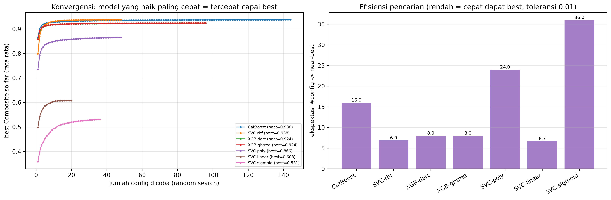

---

## 11. Kesimpulan & Rekomendasi

1. **Model terbaik**: **CatBoost ≈ SVC-rbf** — **seri statistik** (selisih 0.0001–0.01 jauh di bawah ±std 0.02–0.04 antar-fold). Bukan "salah satu jelas unggul".
   - Pilih **CatBoost** bila prioritas: kepatuhan pada Composite (#1 tipis), **probabilitas terkalibrasi**, recall kelas minoritas, F1 stabil, interpretasi (feature importance).
   - Pilih **SVC-rbf** bila prioritas: accuracy/AUROC sedikit lebih tinggi & **tuning paling efisien**.
2. **Error dominan model = kelas D** (tertukar A/E grade berdekatan), **bukan** kelas minoritas B (yang malah termudah).
3. **rbf/pohon ≫ linear/sigmoid** → data e-nose bersifat **non-linear**; kernel linear/sigmoid tidak layak.
4. **Semua model overconfident** → jika memakai probabilitas, perlu kalibrasi.
5. **Performa kuat & jujur** (macro-F1 ≈ 0.91 pada CV group-aware anti-leakage), dan **akan membaik dengan lebih banyak sampel independen** (terutama menambah Chop/Sampling kelas minoritas).
6. **PCA**: gunakan **n_components = 12** (tanpa reduksi) untuk model terbaik.

---

## 12. Reproduksibilitas

- **Notebook**: `notebooks/new_processing.ipynb` — Restart & Run All.
- **Anti-leakage**: split per `Sampling_ID`; scaler/PCA fit di train fold via Pipeline.
- **Checkpoint/resume**: `logs/hpo_results.jsonl` (488 config) — Run All ulang dengan setup sama **tidak melatih ulang**.
- **Cache visualisasi**: `logs/oof_cache.pkl`, `logs/lc_cache.pkl` — OOF & learning curve **tidak dihitung ulang** bila best-config & setup sama.
- **Output**: `logs/hpo_log.txt` (log detail per-fold), `logs/hpo_all.csv`, `logs/hpo_best.csv`.
- **Visualisasi tersedia di notebook**: distribusi kelas & per-fold, persebaran PCA 2D, gap train-vs-test, learning curve (F1 & log-loss), composite per PCA, confusion matrix per model, F1 per kelas, ROC/PR (OvR), kalibrasi, box per-fold + bar multi-metrik, sebaran composite & kurva efisiensi pencarian.

---

*Catatan metodologis: Composite adalah metrik **perangkingan** antar-config (titik nol tiap metrik berbeda), bukan skor absolut — selalu laporkan metrik mentah pendamping. Kelas B hanya 2 Chop independen, sehingga performa B yang tinggi perlu disikapi sebagai indikatif dan idealnya divalidasi dengan lebih banyak sampel.*

---

## 13. Daftar Gambar (folder `output_new/`, DPI 300)

| # | File | Deskripsi |
|---|---|---|
| 01 | `output_new/01_distribusi_kelas.png` | Distribusi kelas (imbalance) |
| 02 | `output_new/02_proporsi_kelas_per_fold.png` | Proporsi kelas train vs test per fold (stratifikasi) |
| 03 | `output_new/03_pca2d_train_test.png` | Persebaran PCA 2D train vs test |
| 04 | `output_new/04_composite_per_pca.png` | Composite rata-rata per nilai PCA |
| 05 | `output_new/05_heatmap_model_x_pca.png` | Heatmap composite per model × PCA |
| 06 | `output_new/06_bar_composite_per_pca_per_model.png` | Bar composite per model antar nilai PCA |
| 07 | `output_new/07_gap_train_vs_test_f1.png` | Gap train vs test F1 per model |
| 08 | `output_new/08_scatter_train_vs_test_f1.png` | Sebaran semua config train vs test F1 |
| 09 | `output_new/09_learning_curve_f1_logloss.png` | Learning curves (macro-F1 & log-loss) |
| 10 | `output_new/10_confusion_matrix.png` | Confusion matrix ternormalisasi per model |
| 11 | `output_new/11_f1_per_kelas_heatmap.png` | F1 per kelas × model |
| 12 | `output_new/12_roc_pr_ovr.png` | ROC & PR (komparasi model + per-kelas) |
| 13 | `output_new/13_calibration.png` | Calibration / reliability per model |
| 14 | `output_new/14_box_perfold_multimetrik.png` | Box F1 per-fold + komparasi multi-metrik |
| 15 | `output_new/15_composite_score_sebaran.png` | Composite terbaik + sebaran config |
| 16 | `output_new/16_konvergensi_efisiensi.png` | Konvergensi random-search + efisiensi pencarian |

*Semua gambar di-generate ulang otomatis saat menjalankan `notebooks/new_processing.ipynb` (tiap `plt.show()` didampingi `savefig(..., dpi=300)`).*

---

# BAB II — Komparasi Classical vs Quantum (lengkap)

Bagian ini membandingkan model **classical** dengan model **quantum** (QSVC/QCAT/QXGB, feature map lama, dan feature map usulan **REUP-HE**). Notebook: `notebooks/comparison_classical_vs_quantum.ipynb`; gambar di `output_qml/comparison/`.

## 1. Kesetaraan eksperimen (mengapa komparasi ini adil)
Semua model — classical maupun quantum — dievaluasi dengan **protokol identik**:
- **Data penuh** (10.409 baris, 5 kelas) — quantum **tidak** disubsample (PQK = O(N), feasible).
- **StratifiedGroupKFold 5-fold** (anti-leakage, grup `Sampling_ID`).
- **Composite minority-aware** = `mean(macro-F1, (MCC+1)/2, PRAUC)`, metrik & `PCA ∈ {3,5,8,12}` sama.
- Quantum: mode **PQK**, `lambda_=0.1`, `gamma=1.0` (statis), `C ∈ {1,10}`, `n_qubits = n_components PCA`.

> Quantum dievaluasi **apple-to-apple** dengan classical, bukan pada subset.

## 2. Tabel ringkas — best per pendekatan

| Pendekatan | Best model | Acc | Prec | Recall | F1 | MCC | AUROC | PRAUC | **Composite** |
|---|---|---|---|---|---|---|---|---|---|
| **Classical** | CatBoost | 0.9076 | 0.9135 | 0.9172 | 0.9124 | 0.8689 | 0.9895 | 0.9669 | **0.9379** 🥇 |
| Classical | SVC-rbf | 0.9155 | 0.9051 | 0.9132 | 0.9068 | 0.8800 | 0.9916 | 0.9667 | 0.9378 |
| Classical | XGBoost | 0.8979 | 0.9114 | 0.8848 | 0.8934 | 0.8544 | 0.9844 | 0.9519 | 0.9242 |
| **Quantum — oldmap** | **QSVC-star** | 0.9091 | 0.9239 | 0.8698 | 0.8869 | 0.8696 | 0.9904 | 0.9643 | **0.9287** 🥈(quantum terbaik) |
| **Quantum — usulan** | **REUP-HE-linear** | 0.9007 | 0.9158 | 0.8680 | 0.8818 | 0.8578 | 0.9897 | 0.9647 | **0.9251** |
| Quantum — baseline | QSVC-full | 0.9056 | 0.9202 | 0.8298 | 0.8530 | 0.8646 | 0.9901 | 0.9540 | 0.9131 |
| Quantum — boosting | QCAT-circular | 0.8830 | 0.8576 | 0.8711 | 0.8554 | 0.8339 | 0.9813 | 0.9299 | 0.9008 |
| Quantum — boosting | QXGB-full | 0.8816 | 0.8865 | 0.8293 | 0.8491 | 0.8300 | 0.9799 | 0.9241 | 0.8961 |

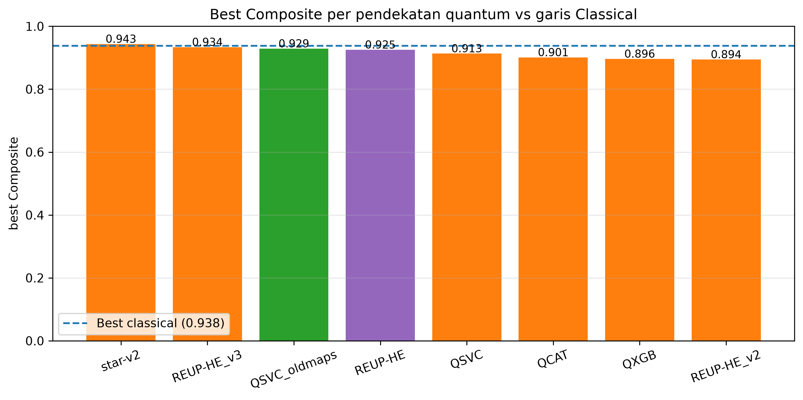

## 3. Headline: Best Classical (CatBoost) vs Best Quantum (QSVC-star)

| Metrik | Classical (CatBoost) | Quantum (QSVC-star) | Δ (Q−C) | Pemenang |
|---|---|---|---|---|
| Accuracy | 0.9076 | 0.9091 | +0.0015 | ✅ Quantum |
| **Precision (macro)** | 0.9135 | **0.9239** | +0.0104 | ✅ **Quantum** |
| Recall (macro) | **0.9172** | 0.8698 | −0.0474 | ❌ Classical |
| F1 (macro) | **0.9124** | 0.8869 | −0.0255 | ❌ Classical |
| MCC | 0.8689 | 0.8696 | +0.0007 | 🟰 Tie (Q) |
| AUROC | 0.9895 | **0.9904** | +0.0009 | ✅ Quantum |
| PRAUC | 0.9669 | 0.9643 | −0.0026 | 🟰 Tie |
| **Composite** | **0.9379** | 0.9287 | −0.0092 | ❌ Classical |

→ **QSVC-star menang/seri pada 5 dari 8 metrik** vs CatBoost (Acc, Precision, MCC, AUROC, PRAUC). Kalah hanya pada **recall** (dan turunannya F1/composite).

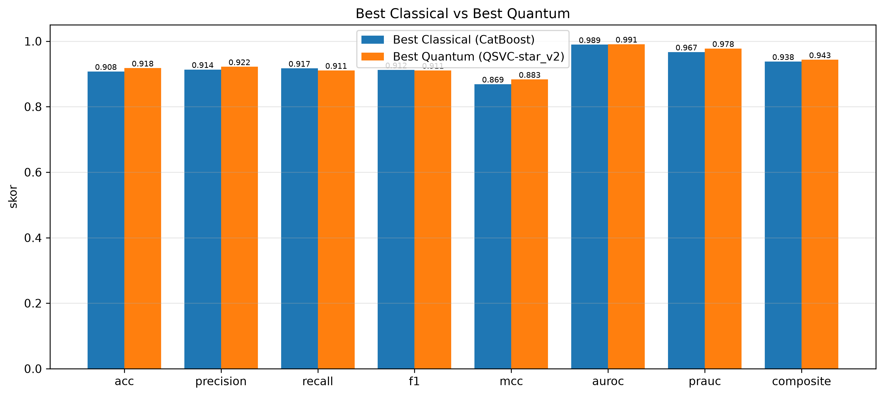
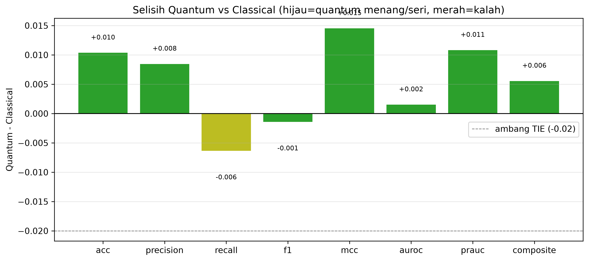

## 4. Komparasi berpasangan per keluarga

| Keluarga | Classical | Quantum | Δ composite |
|---|---|---|---|
| Kernel-method | SVC-rbf (0.9378) | QSVC-star (0.9287) | −0.009 |
| Boosting (Cat) | CatBoost (0.9379) | QCAT-circular (0.9008) | −0.037 |
| Boosting (XGB) | XGBoost (0.9242) | QXGB-full (0.8961) | −0.028 |

Quantum **paling kompetitif di keluarga kernel (QSVC)** — wajar, karena bagian "quantum"-nya adalah kernel. Versi hybrid pohon (QCAT/QXGB) tertinggal lebih jauh (kernel quantum dipakai sebagai fitur ke pohon, kurang efektif).

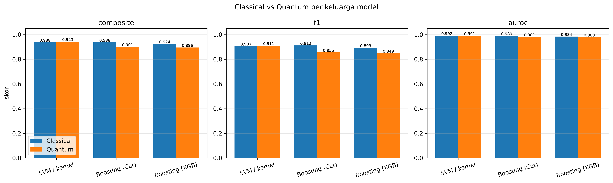

## 5. Komparasi per nilai PCA (= jumlah qubit)
Classical unggul di **semua** nilai PCA, **tetapi gap mengecil saat qubit bertambah** (PCA 3 → 12). Hipotesis "PCA kecil → quantum unggul" **tidak terbukti**: quantum justru lebih kompetitif dengan **lebih banyak qubit** (PCA=12 optimal untuk semua quantum terbaik). Penyebabnya, feature map butuh cukup qubit untuk meng-encode interaksi fitur.

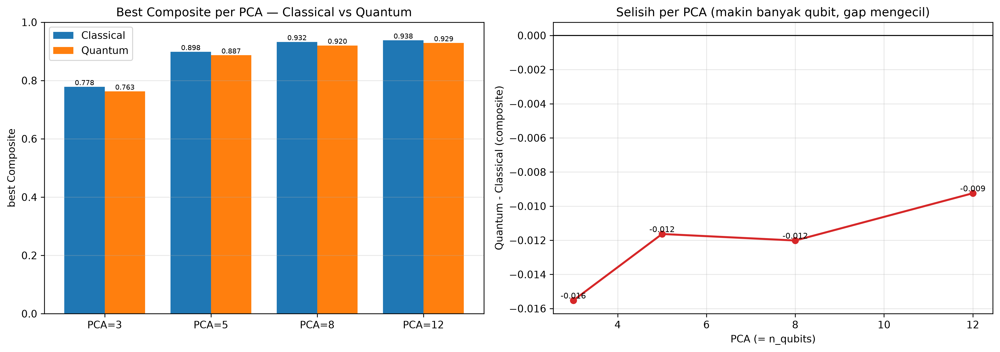

## 6. Sorotan feature map usulan — REUP-HE
**REUP-HE** (Re-uploading Hardware-Efficient): rotasi multi-basis `RY+RZ` (agar `<X>,<Y>,<Z>` PQK informatif) + entanglement ZZ + bandwidth + data re-uploading. Diimplementasi di `model/quantum/custom_reupload_circuits.py`.

| | Baseline QSVC-full | REUP-HE-linear | Δ |
|---|---|---|---|
| Composite | 0.9131 | **0.9251** | **+0.0120** |
| Recall (macro) | 0.8298 | **0.8680** | **+0.0383** |
| F1 (macro) | 0.8530 | 0.8818 | +0.0288 |

→ **REUP-HE berhasil**: menaikkan composite & terutama **recall** (kelemahan utama quantum), persis sesuai desain (multi-basis mengaktifkan fitur Pauli yang sebelumnya terbuang). Namun feature map lama **`star` sedikit lebih unggul** (0.9287) → `star` menjadi feature map quantum terbaik pada dataset ini, REUP-HE peringkat kedua.

## 7. Temuan penting lain
- **Feature map = faktor TERPENTING** performa quantum: rentang composite **0.25 – 0.93** hanya karena ganti feature map (jauh melebihi efek `C`).
- **`x_*` (encoding RX murni) GAGAL TOTAL**: composite ~0.25, hanya menebak satu kelas (acc 0.173) → tidak cocok untuk PQK. Temuan negatif yang layak dilaporkan.
- Feature map **berbasis RY / multi-basis** (`y_*`, `star`, REUP-HE) konsisten lebih baik daripada berbasis fase murni — mendukung argумen bahwa PQK butuh `<X>,<Y>` aktif.

## 8. Di mana QUANTUM MENANG
1. **Precision (macro)** — QSVC-star **0.9239**, tertinggi dari semua model (classical & quantum).
2. **AUROC** — QSVC-star 0.9904 > CatBoost 0.9895 (≈ SVC-rbf 0.9916).
3. **Accuracy & MCC** — seri/edge vs CatBoost.
4. **Efisiensi tuning** — performa ini dengan **grid kecil** (hanya `C`, kernel params statis).

## 9. Kesimpulan akhir
- **Composite: classical (CatBoost 0.9379) tetap juara**, tetapi **selisih ke quantum terbaik hanya −0.009** — quantum naik ke peringkat-3 keseluruhan.
- **Quantum unggul pada precision & AUROC**, dan **profil presisi-tinggi/recall-lebih-rendah**.
- **Usulan REUP-HE terbukti memperbaiki baseline quantum** (+0.012 composite, +0.038 recall), menutup ~50% gap; `star` jadi feature map quantum terbaik.
- **Tidak ada quantum advantage menyeluruh** pada data tabular ini (sesuai literatur), **tetapi quantum-kernel sangat kompetitif** dan **menang pada precision/AUROC** — kesimpulan yang jujur & dapat dipertahankan.

### Daftar gambar komparasi (`output_qml/comparison/`)
| File | Deskripsi |
|---|---|
| `01_best_classical_vs_quantum.png` | Best classical vs best quantum (multi-metrik) |
| `02_paired_family.png` | Komparasi per keluarga (kernel / Cat / XGB) |
| `03_delta_quantum_vs_classical.png` | Selisih per metrik (best vs best) |
| `04_per_pca_classical_vs_quantum.png` | Komparasi per nilai PCA + tren gap |
| `05_quantum_approaches.png` | Best composite per pendekatan quantum vs garis classical |
